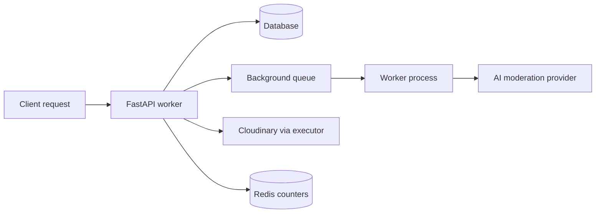
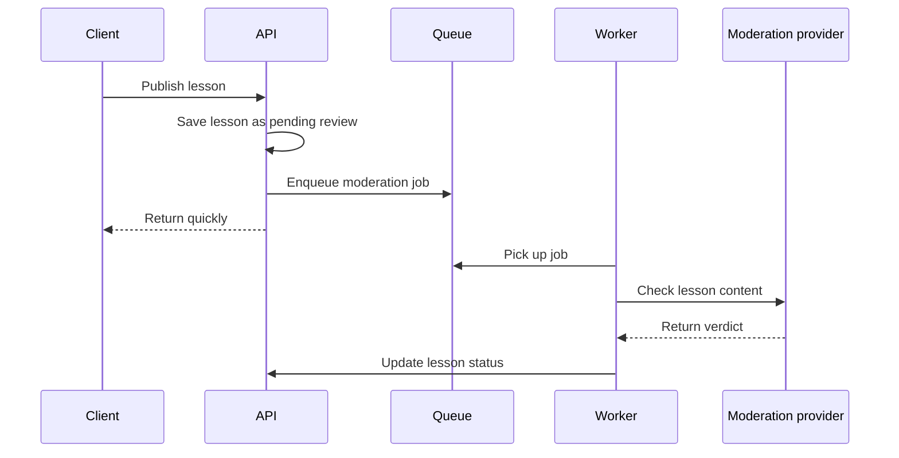
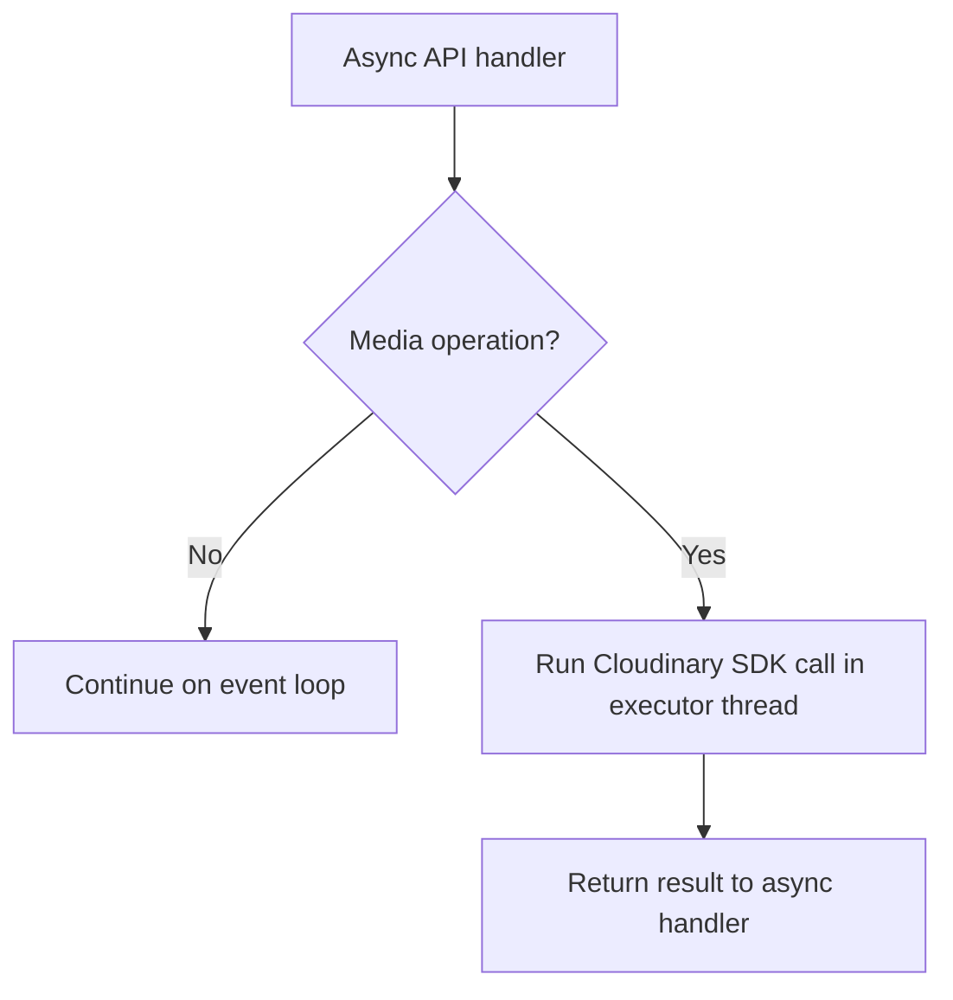
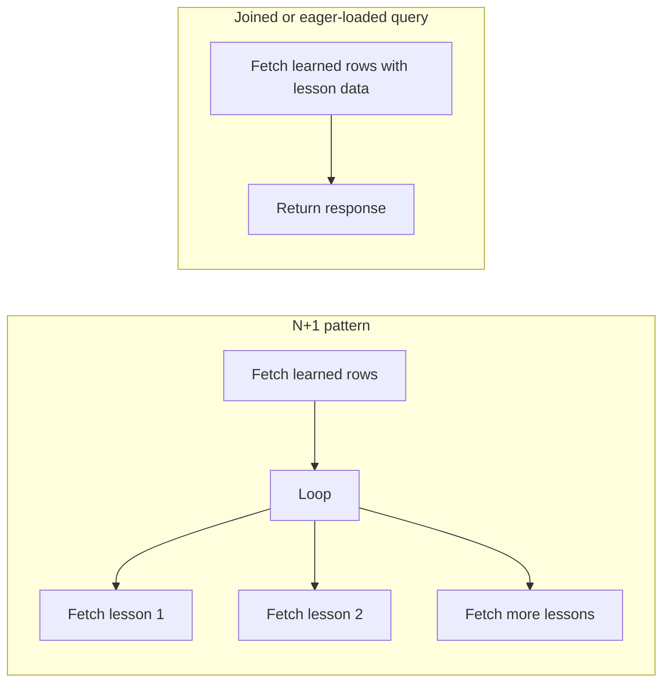
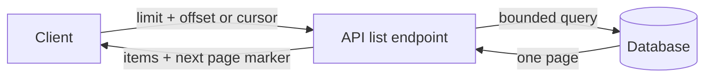
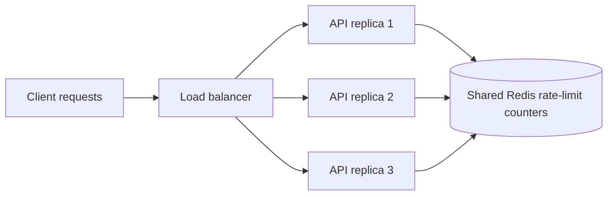

# Vulnerabilities and Other Issues — Readable Mitigation Plan

This document explains the current back-end state of **spark_edu**, the main
security and reliability issues found in that state, and the recommended order
for fixing them. It intentionally avoids dense diagrams and complex schemas so it
can be read from top to bottom as an implementation guide.

## Executive summary

The application is close to being deployable as a small demo service, but it is
not yet safe to expose as a production service or scale horizontally. The main
reason is that several important pieces of state are either not validated,
stored only inside one process, or tied to a local SQLite database file.

The most urgent work is to fix authentication and error handling. After that,
the database and runtime infrastructure should be made production-ready. Once
those foundations are stable, the slow external calls and list endpoints can be
optimized. The final phase is operational polish: logs, configuration, and
consistent API errors.

Recommended order:

| Order | Phase | Goal | Result |
|---:|---|---|---|
| 1 | Security hot-fixes | Stop accepting expired tokens, make refresh tokens revocable, and stop leaking DB internals | Safer public exposure |
| 2 | Database and infrastructure readiness | Replace SQLite for production, add migrations, and simplify startup behavior | Horizontal scaling becomes possible |
| 3 | Async and performance work | Move slow moderation work out of request handling, avoid event-loop blocking, and reduce expensive queries | The service remains responsive under load |
| 4 | Operational polish | Standardize errors, configuration, and logs | Easier support and production operations |

## Current state

The current application is an async FastAPI back end with SQLAlchemy async,
SQLite storage, Cloudinary media storage, JWT authentication, and AI moderation
through external providers. This is a practical shape for a constrained demo
deployment, especially when the target server is small.

The application layer is mostly stateless: user sessions are represented by
tokens, media is stored outside the application process, and routers are split by
domain. That is a good foundation. However, the dependencies around the app are
not ready for production scale yet. SQLite is a single-file database, rate-limit
state is process-local, refresh tokens cannot currently be revoked, and AI
moderation is awaited inside the request path.

## Main issues at a glance

| ID | Severity | Area | Current issue | Why it matters |
|---|---|---|---|---|
| A1 | Critical | Auth | Expired JWTs are accepted in `auth/jwt_handler.py` because expiry validation is disabled in `get_current_user` | Stolen or old tokens may continue working |
| A2 | Critical | Auth | Refresh tokens have no server-side identifier or revocation store | Logout and password reset cannot reliably invalidate sessions |
| A3 | Critical | API errors | Some endpoints return raw `IntegrityError` text to clients | Database structure and constraint details can leak |
| B1 | High | Database | Production state is tied to SQLite | Multiple app replicas cannot safely share or coordinate writes |
| B2 | High | Moderation | Lesson publishing waits for AI moderation inline | Requests can hang and workers can be saturated by slow external calls |
| B3 | High | Media | Cloudinary SDK calls are synchronous in async paths | The event loop can be blocked during media uploads or deletes |
| B4 | High | Database | Tables are created with `Base.metadata.create_all` on startup | Schema changes are not versioned or safely repeatable |
| C1 | Medium | Queries | Learned-lessons retrieval performs an N+1 pattern | The endpoint gets slower as user data grows |
| C2 | Medium | API lists | List endpoints have no pagination | Large result sets can hurt memory, latency, and clients |
| C3 | Medium | Startup | `main.py` contains multiple startup handlers | Startup ordering becomes harder to reason about as the app grows |
| C4 | Medium | Hygiene | Debug `print(row)` calls remain in database paths | Production logs become noisy and unstructured |
| C5 | Medium | Rate limits | `slowapi` state is in memory by default | Limits are bypassed or multiplied when replicas are added |
| D1 | Low | API errors | Error response bodies are inconsistent | Clients need special-case parsing logic |
| D2 | Low | Config | Some configuration is hard-coded | Deployment changes require code changes and increase secret risk |
| D3 | Low | Observability | Logs are not structured around request IDs | Debugging distributed production issues is harder |

## Where to look in the code

| Area | File or symbol | Related issue IDs |
|---|---|---|
| JWT validation | `auth/jwt_handler.py`, especially `get_current_user` | A1 |
| Refresh-token lifecycle | `auth/jwt_handler.py` and auth refresh/logout flows | A2 |
| Database error handling | `end_points/*.py` handlers catching `IntegrityError` | A3, D1 |
| Database configuration | `databases/main_databases.py` | B1, B4 |
| Application startup | `main.py` | B4, C3 |
| Lesson publishing and moderation | `end_points/lessons.py` | B2 |
| Cloudinary integration | `cloud_storage/*.py` | B3 |
| Learned lessons query | `end_points/learn.py` | C1 |
| List endpoints | Router functions returning collections | C2 |
| Debug output | `databases/*.py` | C4 |
| Rate limiting | `slowapi` setup and middleware configuration | C5 |

## Phase 1 — Security hot-fixes

Phase 1 should be completed before any public production deployment. These items
reduce the risk of account misuse and accidental data exposure.

### Step 1. Enforce JWT expiration

Current issue: `get_current_user` decodes JWTs with expiration validation turned
off. That means a token can be accepted even after its `exp` timestamp has
passed.

Mitigation: use the existing token verification path that validates expiration,
or otherwise decode tokens with normal expiry checks enabled. Add a regression
test proving that an expired token returns `401 Unauthorized`.

Expected result: access tokens stop working when their expiration time passes.

### Step 2. Make refresh tokens revocable

Current issue: refresh tokens are accepted without checking a server-side token
record. Without a stored token identifier, the server cannot reliably distinguish
an active refresh token from one that should have been invalidated.

Mitigation: issue each refresh token with a unique identifier, store active token
identifiers in a database table or Redis, and check that store during refresh.
Mark the identifier revoked on logout, password change, or account compromise.

Expected result: logout and security events can invalidate future refresh
attempts.

### Step 3. Sanitize database errors

Current issue: raw database exceptions may be converted directly into HTTP
response details. That can expose table names, column names, constraint names,
and sometimes user-provided values.

Mitigation: centralize handling for `IntegrityError` and related database
exceptions. Return safe user-facing messages such as “This e-mail is already in
use” and log the original exception only on the server.

Expected result: clients receive useful but safe errors, while operators still
have enough server-side detail to debug failures.

## Phase 2 — Database and infrastructure readiness

Phase 2 removes the biggest blockers to horizontal scaling and safe releases.
After this phase, the API can run behind a load balancer with multiple replicas,
provided the remaining shared state is also moved out of process.

### Step 4. Move production data from SQLite to PostgreSQL

Current issue: SQLite is a single-file database with limited write concurrency.
It is suitable for demos and local development, but not for multiple production
API replicas writing at the same time.

Mitigation: use PostgreSQL for production with SQLAlchemy's async PostgreSQL
driver. Keep SQLite only if needed for local development or tests. Configure
connection pooling, overflow limits, and connection health checks through
environment-driven settings.

Expected result: the database can support concurrent application replicas and
more predictable production operations.

### Step 5. Replace startup table creation with migrations

Current issue: `Base.metadata.create_all` creates missing tables at startup, but
it does not provide a reliable history of schema changes. It also makes release
ordering harder to control.

Mitigation: introduce versioned migrations with Alembic. Create a baseline
migration from the current models and run migrations as a release step, init
container, or deployment job before new application code starts serving traffic.

Expected result: schema changes become reviewable, repeatable, and safer to
apply across environments.

### Step 6. Simplify startup behavior

Current issue: multiple startup handlers make application initialization harder
to understand and can hide ordering problems.

Mitigation: merge related startup work into a single startup path or migrate to
FastAPI's lifespan pattern.

Expected result: startup order is explicit and easier to maintain.

## Phase 3 — Async and performance work

Phase 3 improves responsiveness under load. These changes are less urgent than
security fixes, but they become important as traffic and data size grow.

Visual overview: Phase 3 keeps the API worker focused on short request/response
work. Slow calls, repeated database trips, and shared counters are moved to
places that can be scaled or bounded separately.

### Step 7. Move AI moderation to a background worker

Current issue: lesson publishing waits for AI moderation inside the HTTP request.
If the external AI provider is slow, the request stays open and occupies server
resources.

Mitigation: when a lesson is published, mark it as pending review and enqueue a
background job. A worker should call the moderation provider and update the
lesson status after it receives a verdict.

Expected result: publishing returns quickly, and moderation capacity can be
scaled independently from API capacity.

### Step 8. Prevent Cloudinary calls from blocking the event loop

Current issue: Cloudinary upload and delete operations are synchronous calls used
from async code paths. During those calls, the event loop may be blocked.

Mitigation: run Cloudinary SDK operations in a thread executor or use an async
compatible wrapper if one is adopted later.

Expected result: one slow media operation no longer delays unrelated async
requests on the same worker.

### Step 9. Remove the learned-lessons N+1 query

Current issue: the learned-lessons endpoint fetches related lesson data inside a
loop. Each additional row can trigger another database round trip.

Mitigation: load the needed user-lesson and lesson data in one query using joins
or SQLAlchemy eager loading.

Expected result: the endpoint performs consistently as the number of learned
lessons increases.

### Step 10. Add pagination to list endpoints

Current issue: list endpoints can return all rows at once.

Mitigation: add `limit` and `offset`, or cursor-based pagination, to collection
endpoints. Enforce a maximum page size on the server.

Expected result: list responses stay bounded in size, which protects the server
and improves client behavior.

### Step 11. Move rate-limit state to Redis

Current issue: in-memory rate limiting only applies inside one process. With
multiple replicas, each replica has its own independent limit counter.

Mitigation: configure the rate limiter with Redis storage so all replicas share
the same counters.

Expected result: rate limits remain accurate when the API is scaled out.

## Phase 4 — Operational polish

Phase 4 makes the system easier to run, monitor, and support.

### Step 12. Remove debug prints from production paths

Current issue: raw `print(...)` calls remain in database code.

Mitigation: remove debug prints or replace necessary operational output with the
project's logger.

Expected result: logs become cleaner and easier to search.

### Step 13. Standardize error responses

Current issue: API errors may use different response shapes depending on where
they originate.

Mitigation: define one error response format for user-facing API errors and use
it consistently across routers and exception handlers.

Expected result: clients can parse and display errors without endpoint-specific
logic.

### Step 14. Move configuration into environment-based settings

Current issue: hard-coded values make deployments less flexible and can increase
the risk of accidentally storing sensitive values in source code.

Mitigation: use environment-based settings for database URLs, external service
keys, rate-limit backend URLs, feature flags, and deployment-specific values.

Expected result: the same build can be promoted across environments with only
configuration changes.

### Step 15. Add structured logging and request IDs

Current issue: unstructured logs make it hard to trace one request across API
handlers, background workers, and external calls.

Mitigation: emit structured logs, include a request ID, and propagate that ID
where practical into background work.

Expected result: production incidents are easier to investigate.

## Horizontal scaling readiness

The API should not be horizontally scaled in its current state. The FastAPI code
is mostly stateless, but three shared-state problems block safe scaling:

| Blocker | Current behavior | Scaling problem | Required mitigation |
|---|---|---|---|
| SQLite | One local database file stores application data | Multiple replicas cannot safely coordinate writes through one local file | Use PostgreSQL for shared production data |
| In-memory rate limits | Each process stores its own counters | Effective limits multiply by the number of replicas | Store counters in Redis |
| Inline moderation | API workers wait on external AI calls | More replicas help only partially; slow provider calls still consume API capacity | Use a background worker queue |

After PostgreSQL, Redis-backed rate limiting, and background moderation are in
place, the API can run behind a load balancer with multiple stateless replicas.
Cloudinary can continue handling media storage outside the application process.

## Target production shape in plain language

A production-ready deployment should have the following responsibilities split
clearly:

| Component | Responsibility |
|---|---|
| Load balancer or ingress | Accept client traffic and distribute it across API replicas |
| FastAPI replicas | Handle short HTTP requests, validate tokens, read/write application data, and enqueue slow work |
| PostgreSQL | Store durable application data and support concurrent access from all replicas |
| Redis | Store rate-limit counters, refresh-token revocation state, and background job queues |
| Worker processes | Run slow tasks such as AI moderation outside the request path |
| Cloudinary or replacement media service | Store and serve media files |
| Logging and monitoring stack | Collect request logs, worker logs, metrics, and traces |

In that shape, API replicas can be added or removed without losing state because
shared state lives in PostgreSQL, Redis, or external services rather than inside
one application process.

## Suggested rollout checklist

Use this checklist to track work in the safest order:

- [ ] Enforce JWT expiration in `get_current_user`.
- [ ] Add tests for expired-token rejection.
- [ ] Add refresh-token identifiers and a revocation store.
- [ ] Revoke refresh tokens on logout and sensitive account events.
- [ ] Centralize and sanitize database error handling.
- [ ] Configure PostgreSQL for production.
- [ ] Add Alembic migrations and a baseline migration.
- [ ] Replace startup table creation with a migration step.
- [ ] Consolidate startup handlers.
- [ ] Move AI moderation to a background queue and worker.
- [ ] Run synchronous Cloudinary operations outside the async event loop.
- [ ] Rewrite learned-lessons retrieval to avoid N+1 queries.
- [ ] Add bounded pagination to list endpoints.
- [ ] Configure Redis-backed rate limiting.
- [ ] Remove production debug prints.
- [ ] Standardize API error response bodies.
- [ ] Move deployment configuration into environment-driven settings.
- [ ] Add structured logging with request IDs.

## Final recommendation

Treat Phase 1 as mandatory before public exposure. Treat Phase 2 as mandatory
before scaling beyond one API instance. Treat Phase 3 as mandatory before
expecting reliable performance under bursty or growing traffic. Phase 4 can be
implemented incrementally, but it should not be skipped because it determines how
easily the service can be supported after deployment.
