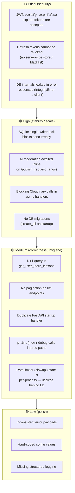
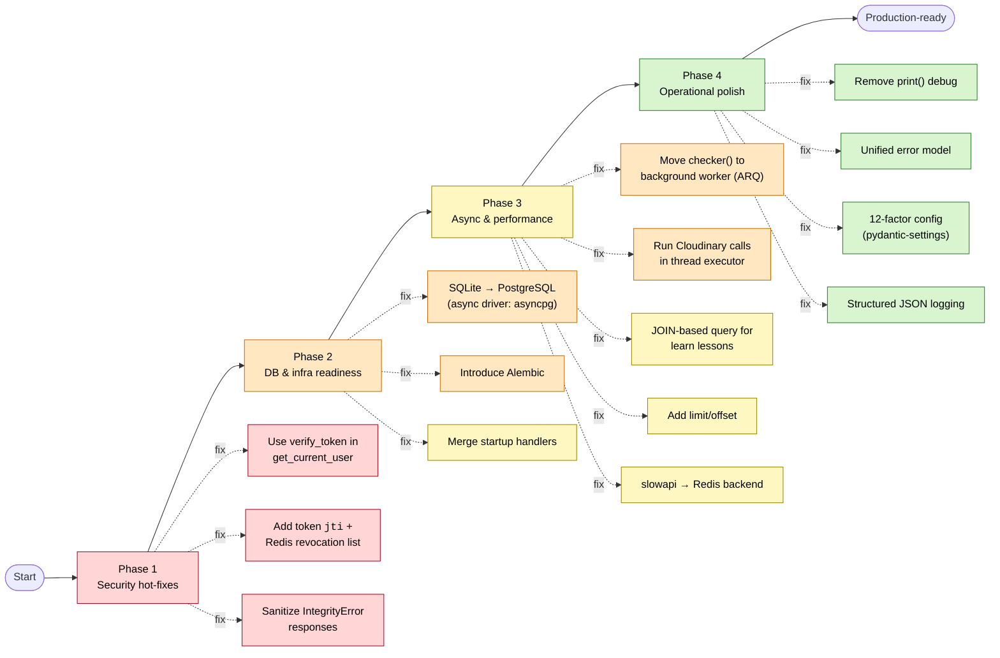
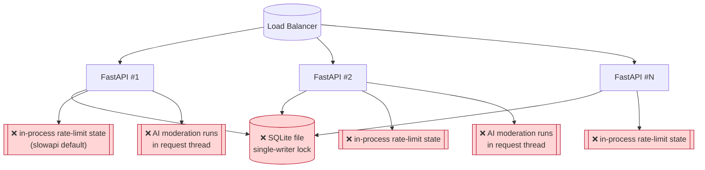
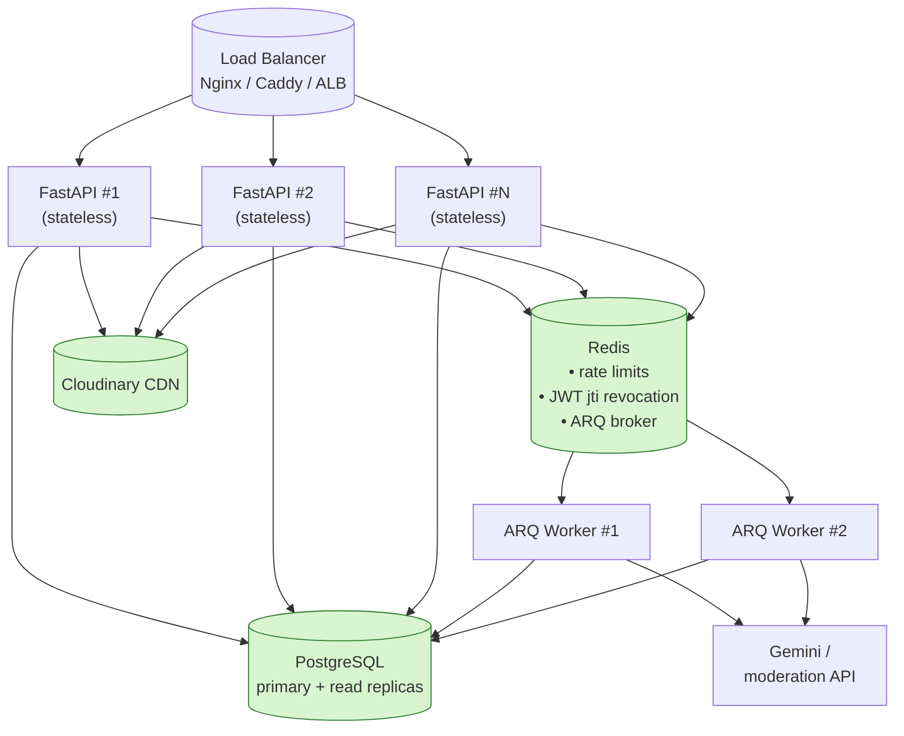
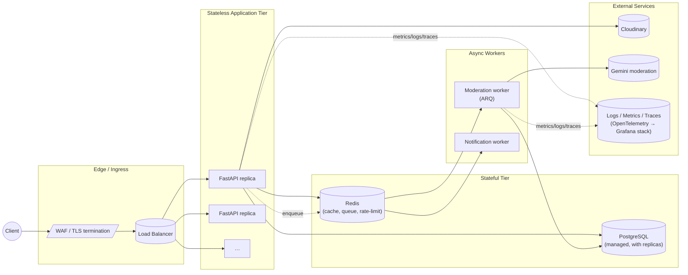
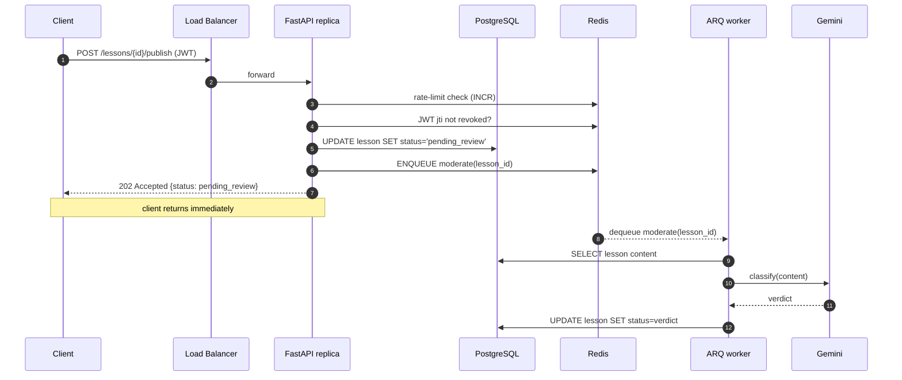
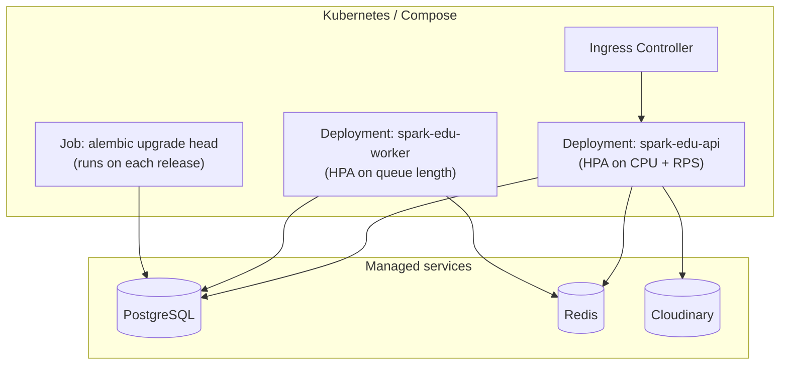

# Vulnerabilities and Other Issues — Mitigation Plan

This document captures the security vulnerabilities, correctness bugs, performance
problems and infrastructure limitations identified in the **spark_edu** back-end,
together with a verbose, prioritised mitigation plan and a future-proof target
architecture.

It is split into four parts:

1. **Inventory** — what is wrong today, grouped by severity.
2. **Per-issue mitigation plan** — concrete fix for each item.
3. **Horizontal-scaling analysis** — can the server be scaled out, and what blocks it.
4. **Future-proof target architecture** — the end-state we are aiming for.

---

## 1. Inventory of Issues

### 1.1 Severity overview

### 1.2 Where each issue lives

| # | Area | File / Symbol | Class |
|---|------|---------------|-------|
| A1 | Auth | `auth/jwt_handler.py` — `get_current_user` uses `decode(..., options={"verify_exp": False})` | Critical |
| A2 | Auth | `auth/jwt_handler.py` — refresh flow has no `jti`/blacklist | Critical |
| A3 | API  | `end_points/*.py` — `except IntegrityError as e: raise HTTPException(detail=str(e))` | Critical |
| B1 | DB   | `databases/main_databases.py` — `sqlite+aiosqlite:///./...` | High |
| B2 | API  | `end_points/lessons.py` — `await checker(lesson_id)` inside request | High |
| B3 | Media| `cloud_storage/*.py` — sync `cloudinary.uploader.*` in async path | High |
| B4 | DB   | `main.py` — `Base.metadata.create_all` on startup | High |
| C1 | DB   | `end_points/learn.py` — loop fetching lesson per user-row | Medium |
| C2 | API  | List endpoints return all rows | Medium |
| C3 | App  | `main.py` — two `@app.on_event("startup")` handlers | Medium |
| C4 | DB   | `databases/*.py` — `print(row)` | Medium |
| C5 | API  | `slowapi` default in-memory limiter | Medium |

---

## 2. Per-Issue Mitigation Plan

### 2.1 Mitigation flow (priority lanes)

### 2.2 Detailed actions

#### Phase 1 — Security hot-fixes (must-do before any public deployment)

- **A1 — Enforce JWT expiry.**
  Replace the `jwt.decode(..., options={"verify_exp": False})` call inside
  `get_current_user` with the existing `verify_token` helper (which already
  validates `exp`). Add a unit test that a token with `exp` in the past returns
  `401`.
- **A2 — Revocable refresh tokens.**
  Issue every refresh token with a unique `jti` claim and persist it in a
  `refresh_tokens` table (or Redis set) keyed by user. On `/auth/logout` and on
  password change, mark the `jti` revoked. On refresh, reject any `jti` not in
  the active set. This is the only way logout actually means logout in a JWT
  world.
- **A3 — Sanitised error responses.**
  Catch `IntegrityError` and other DB errors at a single FastAPI exception
  handler. Map them to user-safe messages (`"This e-mail is already in use"`)
  and log the original exception server-side only. Never echo `str(e)` from the
  ORM to the client — it leaks column names, constraint names, and sometimes
  values.

#### Phase 2 — DB & infra readiness (unblocks scaling)

- **B1 — Move off SQLite.**
  Switch the SQLAlchemy URL to `postgresql+asyncpg://...`. Add `pool_size`,
  `max_overflow`, and `pool_pre_ping=True` to the engine. No application code
  changes are required beyond config — SQLAlchemy abstracts the dialect.
- **B4 — Adopt Alembic.**
  Replace `Base.metadata.create_all` on startup with versioned migrations. Add
  `alembic init`, generate the baseline from the current models, and run
  `alembic upgrade head` as part of container start (or as a Kubernetes Job /
  init container).
- **C3 — Single startup handler.**
  Merge the two `@app.on_event("startup")` callbacks into one (or migrate to
  the modern `lifespan` context manager). Duplicate handlers are fine today
  but masks ordering bugs as the app grows.

#### Phase 3 — Async & performance

- **B2 — Background AI moderation.**
  Replace `await checker(lesson_id)` on `/publish` with enqueueing a job into a
  task queue (ARQ + Redis is the lightest choice; Celery if you already use it
  elsewhere). The endpoint returns immediately with status `pending_review`;
  the worker updates the lesson status when Gemini responds.
- **B3 — Non-blocking Cloudinary.**
  Wrap each `cloudinary.uploader.upload/destroy` call in
  `await asyncio.to_thread(...)` (or `loop.run_in_executor`). This keeps the
  event loop free instead of blocking it for the duration of an HTTP round-trip
  to Cloudinary.
- **C1 — Eliminate the N+1.**
  Rewrite `get_user_learn_lessons` as a single query with `selectinload` /
  `joinedload`, or a manual JOIN, so the DB returns user-lessons + lessons in
  one round-trip.
- **C2 — Pagination.**
  Add `limit: int = 20` / `offset: int = 0` query params (or cursor pagination)
  on every list endpoint. Cap `limit` server-side.
- **C5 — Distributed rate limiting.**
  Configure `slowapi` with a Redis storage backend so limits are enforced
  across all replicas, not per-process.

#### Phase 4 — Operational polish

- **C4** — Delete every `print(...)` left in the data layer.
- **D1** — Unify error responses with a single Pydantic schema
  (`{code, message, details?}`).
- **D2** — Move secrets/config to `pydantic-settings` (`Settings(BaseSettings)`)
  reading from env vars. Remove any literal keys from source.
- **D3** — Switch logging to structured JSON (`structlog` or `loguru`) with a
  request-id middleware so logs are aggregatable in any log stack.

---

## 3. Horizontal Scaling Analysis

### 3.1 Can we scale out today?

**No — not safely.** The current state has three blockers:

1. **SQLite** is a single-file, single-writer database. Multiple replicas would
   either share the file over a network filesystem (which causes corruption) or
   each have its own copy (which causes divergence). This alone makes true
   horizontal scaling impossible.
2. **Rate limiter state lives in process memory.** With N replicas the
   effective limit becomes `N × configured_limit`, and an attacker can
   round-robin through replicas.
3. **Moderation runs in the request thread.** Even with N replicas, a burst of
   `/publish` calls saturates worker threads waiting on Gemini.

Note: the FastAPI app itself is **already stateless** — no per-instance
in-memory session state, sessions are signed cookies, and media is offloaded to
Cloudinary. So the application layer is scale-friendly; only its dependencies
hold it back.

### 3.2 After Phase 1 + Phase 2 + Phase 3 — yes, easily

With Postgres + Redis + workers, replicas can be added freely; all shared state
lives outside the FastAPI process.

---

## 4. Future-Proof Target Architecture

### 4.1 Logical view

### 4.2 Request lifecycle, end-state

### 4.3 Deployment view

### 4.4 What stays from today

The current codebase is **well-positioned** for this evolution:

- async-first FastAPI app is already stateless,
- SQLAlchemy async is already in place — only the URL changes,
- Cloudinary already handles media off-box,
- Routers are cleanly separated by domain.

So the migration is mostly **configuration and infrastructure swaps, not a
rewrite**.

---

## 5. Suggested Rollout Order (TL;DR)

```mermaid
gantt
    title Mitigation rollout (logical order, not calendar)
    dateFormat  X
    axisFormat  %s
    section Phase 1 — Security
    Fix verify_exp=False               :a1, 0, 1
    jti + Redis revocation list         :a2, after a1, 2
    Sanitize IntegrityError responses   :a3, after a1, 1
    section Phase 2 — DB & infra
    SQLite → PostgreSQL                 :b1, after a2, 2
    Alembic baseline + CI step          :b2, after b1, 1
    Merge startup handlers              :b3, after b1, 1
    section Phase 3 — Async & perf
    ARQ + Redis broker                  :c1, after b1, 2
    Move moderation to worker           :c2, after c1, 1
    Cloudinary calls via to_thread      :c3, after b1, 1
    Fix N+1 + add pagination            :c4, after b1, 1
    Redis-backed rate limiter           :c5, after c1, 1
    section Phase 4 — Polish
    Remove print() / unify errors       :d1, after c2, 1
    pydantic-settings + structured logs :d2, after d1, 1
    Observability (OTel)                :d3, after d2, 1
```

After Phase 2 the server can be **horizontally scaled**.
After Phase 3 it scales **efficiently**.
After Phase 4 it is **operable** at production scale.
